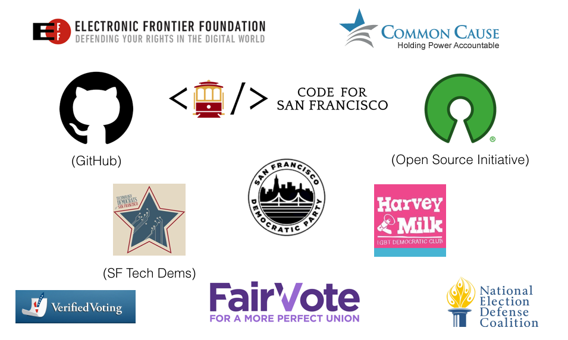

<!--
$theme: default
footer: @catrope | @SFOpenVoting
-->

## [#SFOpenVoting]()

## Freeing the software that runs our elections

#### Strange Loop 2018
##### Roan Kattouw

---
<!-- page_number: true -->

# Why an open source voting system?
* What is a voting system?
* Why is free software (especially) important here?
* What software exists already?
* What are we doing in San Francisco?

---
# Why use software for elections?

---

---

---
# Big ballots: November 2016 election
* 3 federal offices (President+VP, Senate, House)
* 3 state offices (Assembly, Senate, Judge)
* 4 city/regional offices
* 17 statewide propositions (51 through 67)
* 25 city/regional propositions (A through X and RR)

---
# Big ballots: November 2016 election
* Up to 52 contests on one ballot
* 60 contests total
* 4-page double-sided ballot, 5th page in some districts
* 414k votes -> ~1.8M ballot cards

---
# Ranked choice voting

* Board of Supervisors (30k-40k votes per district)
* Mayor (253k votes in June 2018)
* Requires algorithm to compute result

---

---
# Reasons to use software
* Managing large amounts of data
    * 400k+ ballots with 50+ items -> ~20M total votes
    * Ranked-choice elimination rounds
* Inputting all that data
* Reducing voter error
    * Warn against / prevent invalid votes
* Accessibility features

---
# Types of voting systems
* Hand-counted paper ballots
* Paper ballots with optical scan
* Direct recording (levers)
* Direct recording electronic (DRE)
    * With or without voter-verified paper audit trail (VVPAT)

---
# DREs without paper trail are bad
* Even if the software is free and open! (Which it isn't)
* No way to audit the results, no recounts
* 14 states use this
    * Statewide in NJ, DE, SC, GA, LA
    * Some counties in PA, TX, KS, FL, TN, AR, IN, KY, MS
    * VA decertified DREs in 2017, switched in 2 months
    * Lawsuit against Georgia demanding paper ballots
* Banned in many countries, unconstitutional in Germany

---
# Using software safely
* Use paper ballots
* Audit everything
    * CA: 1% audit
    * Emerging: Risk-Limiting Audit (RLA)
* Publish data
    * SF: detailed ranked-choice data
    * Future: images of every ballot scanned

---
# What we use in San Francisco
* Proprietary system by Dominion (now Sequoia)
* Hand-marked paper ballots optically scanned at the precinct
* DREs with paper trail for accessible voting
* Vote-by-mail ballots scanned at City Hall

---

---
# Voting system hardware
* Accessible voting device
* Precinct ballot scanner
* Central ballot scanner for vote-by-mail

---
# Voting system software
* Ballot layout
* Ballot scanning and interpretation
* Ballot adjudication
* Tabulation
    * Non-trivial for ranked-choice elections
* Results reporting
* Audit assistance

---
# Problems with proprietary systems
* Expensive (SF: $10M up front + $1.1M/year)
* Source code kept secret from public and city govt
* Making changes is hard / impossible
* Small market: 3 major vendors
* Vendor lock-in
* Security issues

---
# Open source is important here
* Election software is critical infrastructure
* Trust in election integrity is important
* Antiquated voting tech is a problem
    * Often too expensive to replace

---
# Practical advantages of open source
* Cheaper over time and across jurisdictions
* Innovation and adaptation easier and cheaper
* Investment for the common good
    * Developing jurisdiction spends more, others save
    * Need state/federal funding

---
# Other free software efforts

---
# Prime III / One4All
* Used in New Hampshire since 2016
* Prime III is GPLv3; One4All is NH's augmented version
* Accessible voting using COTS hardware
* Prints ballots; does not count votes
* QR code scanner to print pre-filled ballot from phone

---

---
# ColoradoRLA
* Software facilitating risk-limiting audits
* Built in 2017 by FreeAndFair for Colorado under AGPLv3
* Phase 2 in progress
* Statistical method to verify optical scan accuracy

---
# Risk limiting audits
* Software interpretation of ballot linked to ballot ID
* Small # of ballot IDs randomly selected
* Physical ballots located and compared to interpretation
* Repeat until probability of winner being wrong is low enough

---
# Other projects
* Travis County, TX: STAR-Vote
    * Design for a full voting system
    * "with a view toward ultimately" releasing as open source
    * Abandoned in 2017
* Los Angeles County, CA: VSAP
    * Full "voter-centered" redesign, cost $282M
    * Will count mail votes in Nov 2018
    * Advertised as open source, but code is not available

---
# San Francisco's project

---
# SF project goals
* Open source from the start (GPLv3)
* Commercial, off-the-shelf (COTS) hardware
* Openly licensed documentation (CC-BY-SA)
* Cheap and easy to reuse
* Set a model for state, country

---
# SF project history

* 2005 - Activists first introduce idea
* 2008 - BoS creates Voting Systems Task Force (VSTF)
* 2011 - VSTF recommends open source
* 2014 - Unanimous Board of Supervisors Resolution
* 2015 - Unanimous Elections Commission Resolution
* 2016 - Mayor & BoS budget $300K for planning phase
* 2017 - Commission forms Technical Advisory Committee
* 2018 - $1.7M budgeted for development

---
# (Some) Supporters

---
# Press coverage

---

---
# Proposed first iteration
* Focus on vote-by-mail ballots (64.6% in June)
    * Scanner hardware+software
    * Software for layout encoding, tabulation, results reporting
    * (+batch management, auditing)
* ~6 devices instead of ~600
* Controlled conditions, highly trained operators
* Easier to phase in than precinct scanners, accessible devices
* Modular procurement

---
# Current status
* OSVTAC meeting monthly, developing recommendations
* Feasibility study came back w/ deeply flawed report
* $1.7M in city budget for 2018-2020
* City hiring a project manager
* Proposal for state matching funds failed

---
# How you can help
* Support
    * Sign up as a supporter, get email newsletter
    * Follow [@SFOpenVoting](https://twitter.com/sfopenvoting) on Twitter
* Contribute
    * Submit PRs to our recommendations: osvtac.github.io
    * Apply for / advertise project manager job: bit.ly/votingjob
* Advocate
	* Build support in your county/state
	* Contact elected officials, election administrators

---
## Contact

* roan.kattouw@sfgov.org (committee)
* roan.kattouw@gmail.com (personal)
* [@catrope](https://twitter.com/catrope) on Twitter

 

## Links
* https://osvtac.github.io
* Apply for the project manager job! bit.ly/votingjob
* Follow [@SFOpenVoting](https://twitter.com/sfopenvoting) on Twitter

 
CC-BY-SA 4.0 
Includes material by Chris Jerdonek